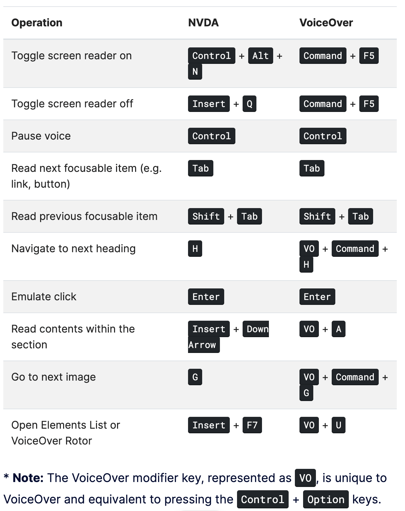
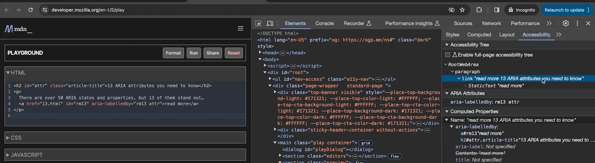

# POUR

1. Perceivable
   Web content is presented to users in ways that are perceivable such as providing alt text on images or adding transcriptions/captions.

2. Operable
   UI components and navigation content are operable by keyboard and mouse.

3. Understandable
   UI should be understandable and show expected behavior. Make things predictable. Buttons are interactive and links navigates the user.

4. Robust
   Content must be robust enough for a variety of users and assistive technologies that consume it.

# WCAG

There are 3 levels of wcag conformance.

1. A: basic
2. AA: Minimum level
3. AAA: Advanced level

# WebAIM

WCAG doc site can be overwhelming. WebAIM is much easier to parse through.

https://webaim.org

# More

1 in 4 Americans have some form of disability. There are 4 categories of disabilities:

1. Visual: Blindness, low vision, color-blindness
2. Auditory: Deafness and hard-of-hearing
3. Motor: Inability to use a mouse, slow response time, limited fine motor control
4. Cognitive: Learning disabilities, distractibility, inability to remember, focus on large amounts of info

# Legal

Not making content accessible can be costly for a business. For example, Domino Pizza got sued when a blind customer could not order food usin their site/app.

And Websites and Software Applications Accessibility Act was introduced to the US Senate.

# As developers

ARIA allows us to tweak the accessbility tree to ensure presentation and behavior intact.

We can create components that are accessible and wouldn't have been possible with just native HTML elements. For example, tablists or accordions.

Can add extra descriptions and label text only exposed to assistive technologies. `aria-describedby`

"NO ARIA is better than Bad Aria": Incorrect usage of ARIA could cause more accessbility barriers.

The Authoring Practices Guide (APG) offers valuable principles for proper ARIA implementation and improving web accessbility.

WAI-ARIA

- provides a framework for the guidelines like a superset

Accessbility Tree:

- a modified DOM tree the browser provides to the assistive technology

## Useful commands

ctrl + options + U: brings up a list of links

ctrl + option + cmd + G: navigate by image



ARIA only modifies the accessbility tree, so it's developer's responsibility to ensure an element's responsiveness and functionality.

Try to use native HTML elements as much as possible because they already have native semantics and keyboard functionalities. Check out the <select> from MDN.

Google search bar is an autocomplete input.

Roles are core aspects of the ARIA system and shorthand for defining a UI pattern. Adds semantic meaning to an element to allow assitive technology interpret the element in the way that is consistent with the way the user expects a type of widget to behave. For example, `combobox`.

ARIA states have a higher likelihood of frequent changes due to user interaction. For example, `aria-checked`
Properties are less likely to change.

A common usage of aria-label would be for an icon button that closes something like the hamburger button.

```
<button aria-label="Close" onclick="myDiaglog.close()">
  <!-- insert svg icon here -->
  <svg aria-hidden="true" focusable="false" />
</button>
```

`aria-labelledby` is a relationship attribute because it creates a semantic relationship between elements. It references an id of another element that contains a label text.



`aria-describedby`, another relationship attribute, links an element to an accessible description by referencing an element's id.

`aria-invalid` indicates user input for an element is incorrect. Typically used in form elements like select menus and textareas.

# Semantic HTML

Best to leverage semantic HTML to get accessbility gains. For example, using <button> and doing some heavy styling versus using a <div> with onclick with reduced CSS.

Hamburger menu, links, and buttons are examples of tech affordances.

Landmark html allows user to quickly navigate content. For example, nav, header, main, section, and footer.

https://www.w3.org/WAI/ARIA/apg/patterns/landmarks/examples/main.html is a great example.

## Aria label and labelled by

- Using both aria-label and aria-labelledby is unnecessary. Only use one or the other. aria-labelledby accepts an ids while aria-label accepts a string. aria-labelledby can contenate the ids' text content values together.

- aria-describedby provides context for the element.

- aria-invalid is usually used to show user input is incorrect. Typically used in input fields, select menus and text areas. It takes a boolean.

# Semantic HTML cont'd

## Technical Affordances

Perceptions of interactions one can take with a piece of software or technology.

For example, the hambuger menu because it represents hidden context and contains links and buttons. It is usually a common link that's persistent between different pages within the website.

## Headings

h1 - h6 provide clear hierarchy for the informtion to help users navigate and identify the structure of the content.

The order of how the screenreaders read these are based on the DOM order.

Visit https://www.w3.org/WAI/ARIA/apg/patterns/landmarks/examples/general-principles.html to see how headings are structured, including landmarks.

Don't use these heading elements for styling. Use CSS instead, alter font-size and etc.

## Landmarks

```
<header />
<nav />
<main>
  <section />
  <section />
</main>
<footer />
```

A lot of landmark elements are semantic HTML. They help screenreaders and users navigate content swiftly.

## Alt Text

If no alt text is present, then the screenreader will read the file name.

If the image doesn't load, alt text would be shown visually on the img element.

# Images

alt text holds a description of the associtated text. It also displays text when the image tag fails to load the image.

## Decorative images

They do not provide signifiant context. It is highly recommended to pass an empty string to the alt attribute; it removes the image from the accessbility tree. This tells the screen readers to ignore it.

Some sites put empty alt text with aria-hidden="true", which can be redundant.

## Functional images

These images represent actions and interactions. It's more important to describe the assoicated action than the appearance.

## Informative images

Alt text should describe the meaning or the intent the image is trying to convey in a brief phrase.

Visit marcysutton.com, open your screen reader, ctrl + option + cmd + u.

The alt text in there are trying to describe the context of the image is trying to say.

## Make your alt text succint and descriptive

- and avoid using words like icon, image or picture. It's redundant because the screen readers already announce the element is an image.

# Labels and Inputs

These two elements typically need to be used in conjunction with each other.

Inputs that rely on placeholder text or icons exclude users with assitive technologies.

So there are assistive benefits to using label and inputs together.

For example, it allows the user to click on the label and it'll focus on the input associated with it. This improves UX and screenreaders will announce the labels properly.

Explicit relationship

```
<form>
  <label for="email-id">Email address: </label>
  <input id="email-id" type="email" />
</form>
```

Implicit relationship

```
<form>
  <label
    >Email address:
    <input type="email" />
  </label>
</form>
```

## There are some situations where you want the label to be hidden.

But we have to make sure assistive technologies can pick it up. Display: none and visibility: hidden are NOT suitable.

You can apply this class to do so:

```
.visually-hidden {
  position: absolute;
  width: 1px;
  height: 1px;
  padding: 0;
  margin: -1px;
  overflow: hidden;
  clip: rect(0, 0, 0, 0);
  border: 0;
}
```

This makes the element visually hidden but still accessible to the accessbility tree.

# Color and Contrast

Color contrast is a measurement of perceived diference in brightness between two colors. Improving this enhances the legibility of content.

We can use a tool called WebAIM contrast checker: https://webaim.org/resources/contrastchecker

It will show you the performance levels of AA and AAA, explanations, and graphic example.

It could important to check WebAIM checklist item 1.4.1.

It would be good to check out the Colour Blindness Awareness site.

We can provide users multiple locations that provides critical information and doesn't rely on color.

Check out validation errors such as Tailwind UI's input. There's an Email label. If there's an error, a error badge shows up inside the input. THe border goes red. And an error message shows up under the input.

# Focus and Keyboard Interactions

UI should be operable by both mouse and keyboard. Focus management is critical for users who rely solely on the keyboard to move around the webpage or screen.

## Tab Order

The sequence in which focus moves through the UI.

Elements like images, paragraphs, and headers are intentionally excluded from the tab order. This is design choice that focuses on elements that users actively engage with to maintain a practicial and efficient user experience.

In webdev tools and accessbility tab, there is a show tab order checkbox. Like the name implies, ticking it will show the sequence of the tab order on the website.

Be cautious when altering the tab order with CSS. Such as using flex and order. Assistive technologies cannot access the tab order made by CSS.

There could be cases where you may want to use CSS to achieve what the design team wants, but it hurts semantic HTML and accessbility.

For example, design could want an image to appear above the heading when it's semantically better to have the image and copy be below the heading. It's semantically better because we want the heading to describe the content below. Following design team's also messes with the natural tab order and assistive technologies.

You can do something like this on the image:

```
order: -1;
```

This would move the image before the heading. But the natural tab order is retained and it helps assistive technology.

## tabindex

Used in situations where we want to modify the tab order, we can set a tabindex attribute.

`tabindex='-1'` removes it from the tab order and inaccessible with keyboard
`tabindex='0'` include it in the default keyboard navigation

Using positive tabindex value is not recommended and should be avoided.

Any tabindex place higher than 0 will be placed at the forefront of the tab order regardless of DOM. It will confuse screen readers and disrupt tab flow. Workaround is just move the element higher in the DOM tree.

Good example is APG website with toolbar example.

Roving tabindex does circular navigation.

# Resources:
